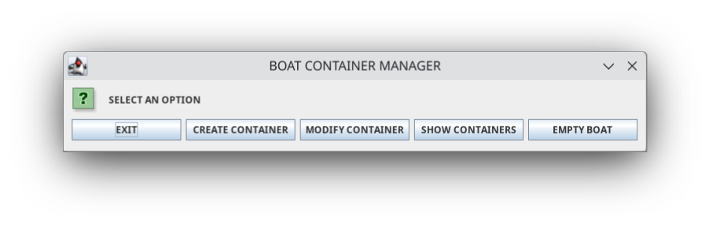

# Java Container Manager

This [Java](https://www.java.com/en/) Container Manager is a simple tool to manage containers. All the user 
interface is done completely with JOptionPane, a Java library to show pop ups on 
screen.

## Table of Contents

1. [Technologies Used](#technologies-used)
2. [Features](#features)
3. [Getting Started](#getting-started)
6. [License](#license)

## Technologies Used

- **Java**
- **JOptionPane**

## Features

The app offers a wide range of features to help you efficiently manage containers of a boat, including:

- **Container creation:** Store and organize essential employee details.

- **Container Modification:** Modify the actual containers you've already created.

- **Container listing:** Show the containers of the boat.

- **Container deletion:** Empty the boat of containers.

## Getting Started

To run this project locally, follow these steps:

1. Clone the repository
2. Open the backend with an IDE like IntelliJ, netBeans, Eclipse, STS4, etc.
3. Run the code.

## License

This project is licensed under the [MIT License](LICENSE).
